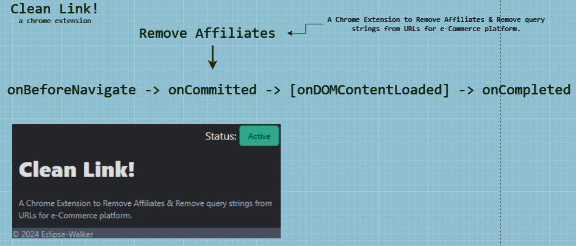

# Clean Link

> A Chrome Extension to Remove Affiliates & Remove query strings from URLs for e-Commerce platform.

## Install and Test the Extension:

1. Open Chrome and go to `chrome://extensions/`
1. Enable Developer mode (toggle the switch at the top right)
1. Click "Load unpacked" and select your project folder `/path/to/file/chrome-extension-remove-affiliates`
1. The extension will appear in Chrome, and you can click the icon to toggle its functionality